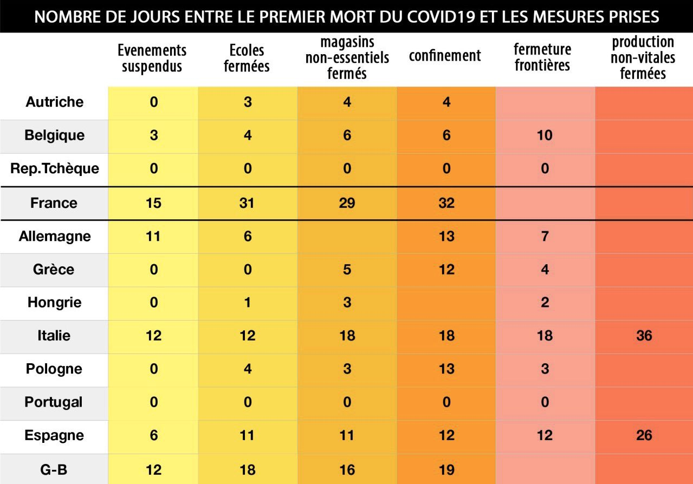
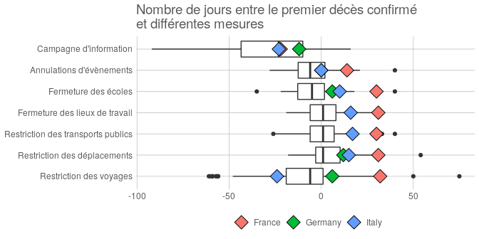
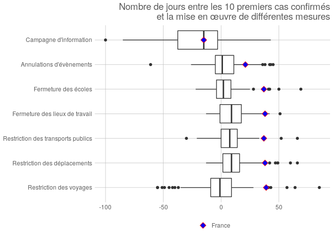

_Attention : Ce travail se base sur un [unique jeu de données](https://ocgptweb.azurewebsites.net/CSVDownload), et les résultats n'ont pas été vérifiés par un tiers. Les sources sont disponibles [ici](https://github.com/juliengossa/covid19)._

Le 28 mars 2020, M. Philippe, Premier ministre Français, déclarait « _Je ne laisserai personne dire qu'il y a eu du retard sur les mesures de confinement_ » [ref](https://www.huffingtonpost.fr/entry/direct-coronavirus-lepidemie-setend-la-moitie-du-monde-en-confinement_fr_5e7e3310c5b6cb9dc19f6953). Peu après apparaissait sur les réseaux sociaux une table présentant les délais entre le premier cas de décés dû au Covid19 et différentes mesures pour différents pays. 

Cette table montre un délais de réponse particulièrement élevé pour la France, comparativement aux autres pays. Ce document vise à reproduire cette table, puis proposer une visualisation du délais des mesures de la France.

## Source des données 

La source des données de cette table semble être une étude mennée par la _Blavatnik School of Government_ de l'Université d'Oxford : « _Variation in government responses to COVID-19_ » [ref](https://www.bsg.ox.ac.uk/research/publications/variation-government-responses-covid-19).

Cette étude propose 13 indicateurs, déclinés en deux dimensions : le niveau de mesure (« pas de mesure », « recommandé », « obligatoire »), et son assiette (« ciblé », « général »). Elle ajoute des informations comme le nombre de cas confirmés et le nombre de décès confirmés. 

Ces indicateurs ne correspondent pas exactement à ceux présentés dans la table. Notamment, on n'y retrouve pas les distinctions « magasins » ou « production », et « vitale » ou « non vitales ».

## Reproduction

Pour reproduire cette table, on peut calculer 5 mesures, plus proches de la source des données, en considérant la date des mesures obligatoires et générales : 
  
  - Annulations d'évènements 
  - Fermeture des écoles
  - Fermeture des lieux de travail 
  - Restriction des déplacements
  - Restriction des voyages 
  
En calculant le délais entre la date du premier cas de décès confirmé et la date de ces mesures, il est possible de produire la table suivante :

__Nombre de jours entre la date du premier décès confirmé, et la mise en œuvre de différentes mesures__

<table>
 <thead>
  <tr>
   <th style="text-align:left;"> Pays </th>
   <th style="text-align:right;"> Annulations d'évènements </th>
   <th style="text-align:right;"> Fermeture des écoles </th>
   <th style="text-align:right;"> Fermeture des lieux de travail </th>
   <th style="text-align:right;"> Restriction des déplacements </th>
   <th style="text-align:right;"> Restriction des voyages </th>
  </tr>
 </thead>
<tbody>
  <tr>
   <td style="text-align:left;"> Austria </td>
   <td style="text-align:right;"> -2 </td>
   <td style="text-align:right;"> -1 </td>
   <td style="text-align:right;"> 3 </td>
   <td style="text-align:right;"> 3 </td>
   <td style="text-align:right;"> -4 </td>
  </tr>
  <tr>
   <td style="text-align:left;"> Belgium </td>
   <td style="text-align:right;"> 2 </td>
   <td style="text-align:right;"> 2 </td>
   <td style="text-align:right;"> 2 </td>
   <td style="text-align:right;"> 6 </td>
   <td style="text-align:right;"> 5 </td>
  </tr>
  <tr>
   <td style="text-align:left;"> Czech Republic </td>
   <td style="text-align:right;"> NA </td>
   <td style="text-align:right;"> NA </td>
   <td style="text-align:right;"> NA </td>
   <td style="text-align:right;"> NA </td>
   <td style="text-align:right;"> NA </td>
  </tr>
  <tr>
   <td style="text-align:left;"> France </td>
   <td style="text-align:right;"> 14 </td>
   <td style="text-align:right;"> 30 </td>
   <td style="text-align:right;"> 31 </td>
   <td style="text-align:right;"> 31 </td>
   <td style="text-align:right;"> 32 </td>
  </tr>
  <tr>
   <td style="text-align:left;"> Germany </td>
   <td style="text-align:right;"> 0 </td>
   <td style="text-align:right;"> 6 </td>
   <td style="text-align:right;"> NA </td>
   <td style="text-align:right;"> 12 </td>
   <td style="text-align:right;"> 6 </td>
  </tr>
  <tr>
   <td style="text-align:left;"> Greece </td>
   <td style="text-align:right;"> -12 </td>
   <td style="text-align:right;"> -1 </td>
   <td style="text-align:right;"> NA </td>
   <td style="text-align:right;"> 11 </td>
   <td style="text-align:right;"> NA </td>
  </tr>
  <tr>
   <td style="text-align:left;"> Hungary </td>
   <td style="text-align:right;"> -5 </td>
   <td style="text-align:right;"> -5 </td>
   <td style="text-align:right;"> NA </td>
   <td style="text-align:right;"> 12 </td>
   <td style="text-align:right;"> -7 </td>
  </tr>
  <tr>
   <td style="text-align:left;"> Italy </td>
   <td style="text-align:right;"> 0 </td>
   <td style="text-align:right;"> 10 </td>
   <td style="text-align:right;"> 16 </td>
   <td style="text-align:right;"> 15 </td>
   <td style="text-align:right;"> -24 </td>
  </tr>
  <tr>
   <td style="text-align:left;"> Poland </td>
   <td style="text-align:right;"> -3 </td>
   <td style="text-align:right;"> -1 </td>
   <td style="text-align:right;"> 0 </td>
   <td style="text-align:right;"> 18 </td>
   <td style="text-align:right;"> 2 </td>
  </tr>
  <tr>
   <td style="text-align:left;"> Portugal </td>
   <td style="text-align:right;"> -6 </td>
   <td style="text-align:right;"> -5 </td>
   <td style="text-align:right;"> NA </td>
   <td style="text-align:right;"> NA </td>
   <td style="text-align:right;"> -8 </td>
  </tr>
  <tr>
   <td style="text-align:left;"> Spain </td>
   <td style="text-align:right;"> 5 </td>
   <td style="text-align:right;"> 11 </td>
   <td style="text-align:right;"> 29 </td>
   <td style="text-align:right;"> 9 </td>
   <td style="text-align:right;"> 5 </td>
  </tr>
  <tr>
   <td style="text-align:left;"> United Kingdom </td>
   <td style="text-align:right;"> 15 </td>
   <td style="text-align:right;"> 17 </td>
   <td style="text-align:right;"> 18 </td>
   <td style="text-align:right;"> 17 </td>
   <td style="text-align:right;"> NA </td>
  </tr>
</tbody>
</table>

On retrouve alors des données très similaires, mais pas tout à fait identiques. Notamment :

- toutes les valeurs sont légèrement différentes ;
- on obtient des délais négatifs lorsque la mesure est prise avant le premier décès confirmé ;
- les données sur le nombre de décès n'est pas dispobnibles la République Tchèque.

Un traitement manuel de certaines données peut possiblement mener à ce type de différences, qui ne sont pas significatives. On peut donc, sous angle, valider les données de la table, en conservant certaines réserves.

Pour confirmer ou infirmer les conclusions de cette table, il convient de vérifier deux choses : le changement du point de référence, et l'extension des données à d'autres pays et d'autres indicateurs.

## Changement du point de référence

Le point de référence généralement utilisé pour étudier la pandémie n'est pas la date du premier décès confirmé, mais la date où 10 cas ont été confirmés.

__Nombre de jours entre la date des 10 premiers cas confirmés, et différentes mesures__

<table>
 <thead>
  <tr>
   <th style="text-align:left;"> Pays </th>
   <th style="text-align:right;"> Annulations d'évènements </th>
   <th style="text-align:right;"> Fermeture des écoles </th>
   <th style="text-align:right;"> Fermeture des lieux de travail </th>
   <th style="text-align:right;"> Restriction des déplacements </th>
   <th style="text-align:right;"> Restriction des voyages </th>
  </tr>
 </thead>
<tbody>
  <tr>
   <td style="text-align:left;"> Austria </td>
   <td style="text-align:right;"> 10 </td>
   <td style="text-align:right;"> 11 </td>
   <td style="text-align:right;"> 15 </td>
   <td style="text-align:right;"> 15 </td>
   <td style="text-align:right;"> 8 </td>
  </tr>
  <tr>
   <td style="text-align:left;"> Belgium </td>
   <td style="text-align:right;"> 10 </td>
   <td style="text-align:right;"> 10 </td>
   <td style="text-align:right;"> 10 </td>
   <td style="text-align:right;"> 14 </td>
   <td style="text-align:right;"> 13 </td>
  </tr>
  <tr>
   <td style="text-align:left;"> Czech Republic </td>
   <td style="text-align:right;"> NA </td>
   <td style="text-align:right;"> NA </td>
   <td style="text-align:right;"> NA </td>
   <td style="text-align:right;"> NA </td>
   <td style="text-align:right;"> NA </td>
  </tr>
  <tr>
   <td style="text-align:left;"> France </td>
   <td style="text-align:right;"> 21 </td>
   <td style="text-align:right;"> 37 </td>
   <td style="text-align:right;"> 38 </td>
   <td style="text-align:right;"> 38 </td>
   <td style="text-align:right;"> 39 </td>
  </tr>
  <tr>
   <td style="text-align:left;"> Germany </td>
   <td style="text-align:right;"> 35 </td>
   <td style="text-align:right;"> 41 </td>
   <td style="text-align:right;"> NA </td>
   <td style="text-align:right;"> 47 </td>
   <td style="text-align:right;"> 41 </td>
  </tr>
  <tr>
   <td style="text-align:left;"> Greece </td>
   <td style="text-align:right;"> -5 </td>
   <td style="text-align:right;"> 6 </td>
   <td style="text-align:right;"> NA </td>
   <td style="text-align:right;"> 18 </td>
   <td style="text-align:right;"> NA </td>
  </tr>
  <tr>
   <td style="text-align:left;"> Hungary </td>
   <td style="text-align:right;"> 0 </td>
   <td style="text-align:right;"> 0 </td>
   <td style="text-align:right;"> NA </td>
   <td style="text-align:right;"> 17 </td>
   <td style="text-align:right;"> -2 </td>
  </tr>
  <tr>
   <td style="text-align:left;"> Italy </td>
   <td style="text-align:right;"> 1 </td>
   <td style="text-align:right;"> 11 </td>
   <td style="text-align:right;"> 17 </td>
   <td style="text-align:right;"> 16 </td>
   <td style="text-align:right;"> -23 </td>
  </tr>
  <tr>
   <td style="text-align:left;"> Poland </td>
   <td style="text-align:right;"> 1 </td>
   <td style="text-align:right;"> 3 </td>
   <td style="text-align:right;"> 4 </td>
   <td style="text-align:right;"> 22 </td>
   <td style="text-align:right;"> 6 </td>
  </tr>
  <tr>
   <td style="text-align:left;"> Portugal </td>
   <td style="text-align:right;"> 5 </td>
   <td style="text-align:right;"> 6 </td>
   <td style="text-align:right;"> NA </td>
   <td style="text-align:right;"> NA </td>
   <td style="text-align:right;"> 3 </td>
  </tr>
  <tr>
   <td style="text-align:left;"> Spain </td>
   <td style="text-align:right;"> 12 </td>
   <td style="text-align:right;"> 18 </td>
   <td style="text-align:right;"> 36 </td>
   <td style="text-align:right;"> 16 </td>
   <td style="text-align:right;"> 12 </td>
  </tr>
  <tr>
   <td style="text-align:left;"> United Kingdom </td>
   <td style="text-align:right;"> 26 </td>
   <td style="text-align:right;"> 28 </td>
   <td style="text-align:right;"> 29 </td>
   <td style="text-align:right;"> 28 </td>
   <td style="text-align:right;"> NA </td>
  </tr>
</tbody>
</table>

Ce changement de point de référence modifie légèrement les conclusions de la table, puisque la France apparait alors comme plus réactive que l'Allemagne.

## Extension à d'autres pays et d'autres indicateurs

Pour étendre les indicateurs, on peut ajouter les mesures suivantes :

- Campagne d'information
- Restriction des transports publics (recommandée et ciblée)

Lire les données en incluant plus de pays sera difficile sous forme de table, et c'est pourquoi il est nécessaire de proposer une représentation graphique.

<!-- -->

Exemple de lecture : « _Parmis les pays ayant mis en œuvre une campagne d'information, le plus réactif l'a fait 92 jours avant le premier décès confirmé, et le moins réactif 16 jours après. La moitié des pays l'ont fait entre 43 et 10 jours avant, et la médiane est à 23 jours avant. La France l'a fait 22 jours avant._ ».

Ce graphique permet de constater que la France est parmis les pays présentant les plus grands délais entre le premier cas de décès confirmé et la prise de mesures, hormis en ce qui concerne la campagne d'information.

<!-- -->

Le changement de point de référence, en prenant la date des 10 premiers cas confirmés, modère le constat fait en prenant pour point de référence le premier décès, sans en changer substantiellement les conclusions.

## Conclusion

Pour conclure, même si la table diffusée sur les réseaux sociaux présente plusieurs informations qui nécessiteraient de plus amples investigations, l'exploitation des données ouvertes collectées par la _Blavatnik School of Government_ de l'Université d'Oxford montre un délais important en France pour la prise de mesures dans la pandémie Covid19, comparativement aux autres pays surveillés, pour les deux points de répères étudiés ici, et les indicateurs étudiés ici.

Une comparaison avec d'autres jeux de données est nécessaire pour confirmer ou infirmer ces résultats. D'autres façons, plus fines, de mesurer les temps de réponses sont disponibles dans [l'étude initiale](https://www.bsg.ox.ac.uk/research/publications/variation-government-responses-covid-19).

Il convient de conclure en affirmant que cette comparaison des délais ne saurait en aucun cas résumer les politiques sanitaires nationales, et que les comparaisons internationnales sont toujours complexes et se doivent d'être distanciées. 
