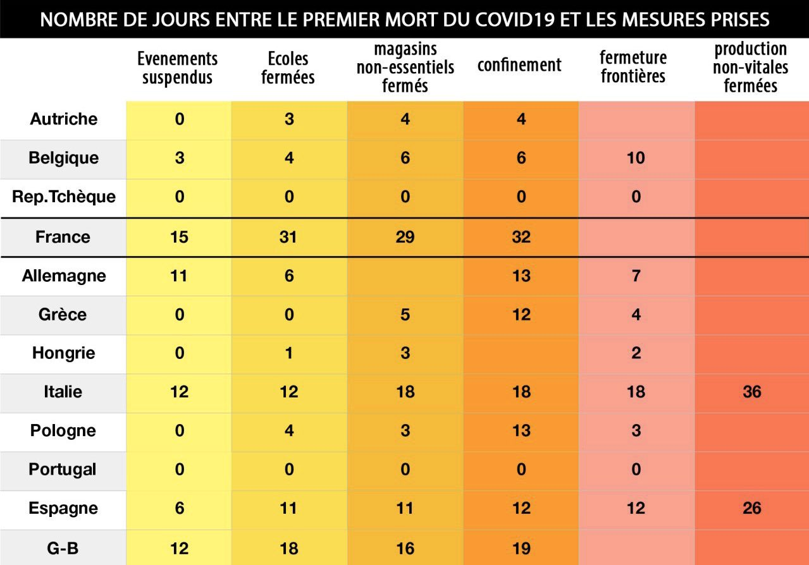
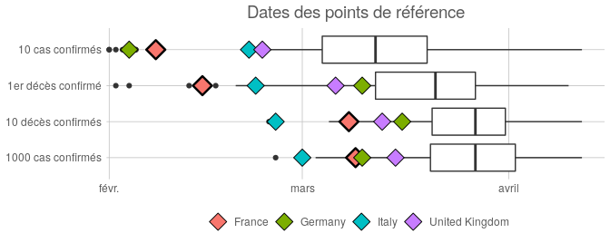
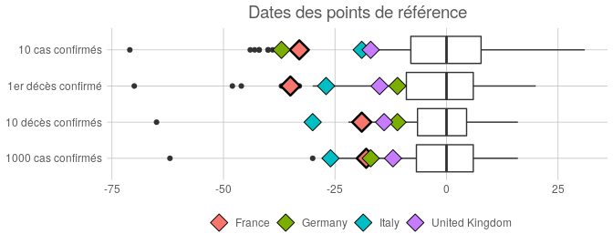
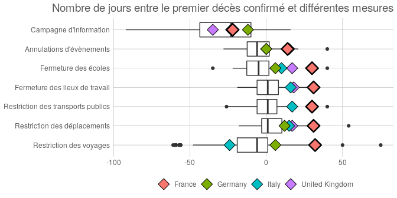
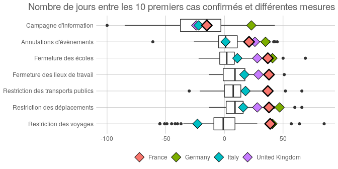
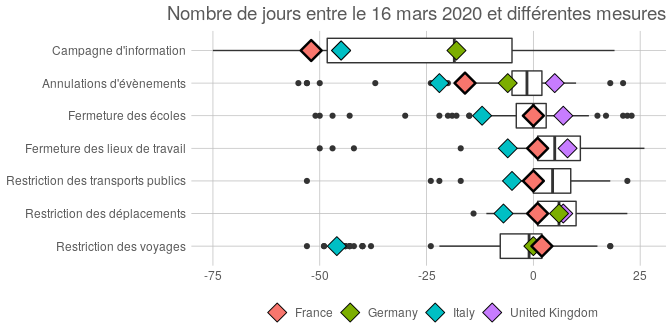
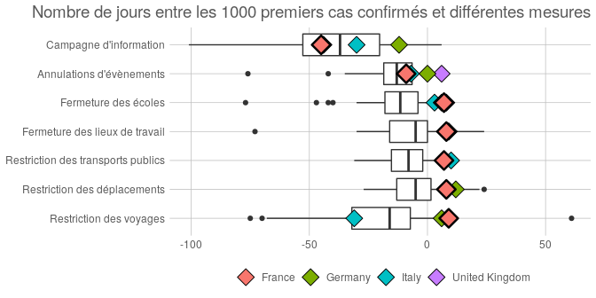

_Attention : Ce travail se base sur un [unique jeu de données](https://ocgptweb.azurewebsites.net/CSVDownload), et les résultats n'ont pas été vérifiés par un tiers. Les sources sont disponibles [ici](https://github.com/juliengossa/covid19)._

Le 28 mars 2020, M. Philippe, Premier ministre Français, déclarait « _Je ne laisserai personne dire qu'il y a eu du retard sur les mesures de confinement_ » [ref](https://www.huffingtonpost.fr/entry/direct-coronavirus-lepidemie-setend-la-moitie-du-monde-en-confinement_fr_5e7e3310c5b6cb9dc19f6953). Peu après apparaissait sur les réseaux sociaux une table présentant les délais entre le premier cas de décés dû au Covid19 et différentes mesures pour différents pays. 

Cette table montre un délais de réponse particulièrement élevé pour la France, comparativement aux autres pays. Ce document a pour objectifs de 

1. reproduire cette table pour vérifier la véracité de ses données ;
1. contrôler le biais du choix du point de référence temporel ;
1. contrôler le biais des choix de l'échantillon d'indicateurs et de pays ;
1. contribuer à la réflexion sur les points de référence temporel.

# Source des données 

La source des données de cette table semble être une étude mennée par la _Blavatnik School of Government_ de l'Université d'Oxford : « _Variation in government responses to COVID-19_ » [ref](https://www.bsg.ox.ac.uk/research/publications/variation-government-responses-covid-19).

Cette étude propose 13 indicateurs, déclinés en deux dimensions : le niveau de mesure (« pas de mesure », « recommandé », « obligatoire »), et son assiette (« ciblé », « général »). Elle ajoute des informations comme le nombre de cas confirmés et le nombre de décès confirmés. 

Ces indicateurs ne correspondent pas exactement à ceux présentés dans la table. Notamment, on n'y retrouve pas les distinctions « magasins » ou « production », et « vitale » ou « non vitales ».

# Reproduction

Pour reproduire cette table, on peut calculer 5 mesures, plus proches de la source des données, en considérant la date des mesures obligatoires et générales : 

  - Annulations d'évènements 
  - Fermeture des écoles
  - Fermeture des lieux de travail 
  - Restriction des déplacements
  - Restriction des voyages 
  
En calculant le délais entre la date du premier cas de décès confirmé et la date de ces mesures, il est possible de produire la table suivante :

<table>
<caption>Nombre de jours entre la date du premier décès confirmé, et la mise en œuvre de différentes mesures</caption>
 <thead>
  <tr>
   <th style="text-align:left;"> Pays </th>
   <th style="text-align:right;"> Annulations d'évènements </th>
   <th style="text-align:right;"> Fermeture des écoles </th>
   <th style="text-align:right;"> Fermeture des lieux de travail </th>
   <th style="text-align:right;"> Restriction des déplacements </th>
   <th style="text-align:right;"> Restriction des voyages </th>
  </tr>
 </thead>
<tbody>
  <tr>
   <td style="text-align:left;"> Austria </td>
   <td style="text-align:right;"> -2 </td>
   <td style="text-align:right;"> -1 </td>
   <td style="text-align:right;"> 3 </td>
   <td style="text-align:right;"> 3 </td>
   <td style="text-align:right;"> -4 </td>
  </tr>
  <tr>
   <td style="text-align:left;"> Belgium </td>
   <td style="text-align:right;"> 2 </td>
   <td style="text-align:right;"> 2 </td>
   <td style="text-align:right;"> 2 </td>
   <td style="text-align:right;"> 6 </td>
   <td style="text-align:right;"> 5 </td>
  </tr>
  <tr>
   <td style="text-align:left;"> France </td>
   <td style="text-align:right;"> 14 </td>
   <td style="text-align:right;"> 30 </td>
   <td style="text-align:right;"> 31 </td>
   <td style="text-align:right;"> 31 </td>
   <td style="text-align:right;"> 32 </td>
  </tr>
  <tr>
   <td style="text-align:left;"> Germany </td>
   <td style="text-align:right;"> 0 </td>
   <td style="text-align:right;"> 6 </td>
   <td style="text-align:right;"> NA </td>
   <td style="text-align:right;"> 12 </td>
   <td style="text-align:right;"> 6 </td>
  </tr>
  <tr>
   <td style="text-align:left;"> Greece </td>
   <td style="text-align:right;"> -12 </td>
   <td style="text-align:right;"> -1 </td>
   <td style="text-align:right;"> NA </td>
   <td style="text-align:right;"> 11 </td>
   <td style="text-align:right;"> NA </td>
  </tr>
  <tr>
   <td style="text-align:left;"> Hungary </td>
   <td style="text-align:right;"> -5 </td>
   <td style="text-align:right;"> -5 </td>
   <td style="text-align:right;"> NA </td>
   <td style="text-align:right;"> 12 </td>
   <td style="text-align:right;"> -7 </td>
  </tr>
  <tr>
   <td style="text-align:left;"> Italy </td>
   <td style="text-align:right;"> 0 </td>
   <td style="text-align:right;"> 10 </td>
   <td style="text-align:right;"> 16 </td>
   <td style="text-align:right;"> 15 </td>
   <td style="text-align:right;"> -24 </td>
  </tr>
  <tr>
   <td style="text-align:left;"> Poland </td>
   <td style="text-align:right;"> -3 </td>
   <td style="text-align:right;"> -1 </td>
   <td style="text-align:right;"> 0 </td>
   <td style="text-align:right;"> 18 </td>
   <td style="text-align:right;"> 2 </td>
  </tr>
  <tr>
   <td style="text-align:left;"> Portugal </td>
   <td style="text-align:right;"> -6 </td>
   <td style="text-align:right;"> -5 </td>
   <td style="text-align:right;"> NA </td>
   <td style="text-align:right;"> NA </td>
   <td style="text-align:right;"> -8 </td>
  </tr>
  <tr>
   <td style="text-align:left;"> Spain </td>
   <td style="text-align:right;"> 5 </td>
   <td style="text-align:right;"> 11 </td>
   <td style="text-align:right;"> 29 </td>
   <td style="text-align:right;"> 9 </td>
   <td style="text-align:right;"> 5 </td>
  </tr>
  <tr>
   <td style="text-align:left;"> United Kingdom </td>
   <td style="text-align:right;"> 15 </td>
   <td style="text-align:right;"> 17 </td>
   <td style="text-align:right;"> 18 </td>
   <td style="text-align:right;"> 17 </td>
   <td style="text-align:right;"> NA </td>
  </tr>
</tbody>
</table>

On retrouve alors des données très similaires, mais pas tout à fait identiques. Notamment :

- toutes les valeurs sont légèrement différentes ;
- on obtient des délais négatifs lorsque la mesure est prise avant le premier décès confirmé ;
- les données sur le nombre de décès n'est pas dispobnibles la République Tchèque.

Un traitement manuel de certaines données peut possiblement mener à ce type de différences, qui ne sont pas significatives. On peut donc, sous angle, valider les données de la table, en conservant certaines réserves.

Pour confirmer ou infirmer les conclusions de cette table, il convient de vérifier deux choses : le changement du point de référence, et l'extension des données à d'autres pays et d'autres indicateurs.

# Changement du point de référence

## Point de référence : 10 premiers cas confirmés

Le point de référence généralement utilisé pour étudier la pandémie n'est pas la date du premier décès confirmé, mais la date où 10 cas ont été confirmés. Utiliser les cas confirmés atténue le biais dû au taux de mortalité, qui ajoute une variation aux taux de contamination ; et utiliser 10 cas est plus solide qu'un seul, qui peut représenter un cas particulier. 

<table>
<caption>Nombre de jours entre la date des 10 premiers cas confirmés, et différentes mesures</caption>
 <thead>
  <tr>
   <th style="text-align:left;"> Pays </th>
   <th style="text-align:right;"> Annulations d'évènements </th>
   <th style="text-align:right;"> Fermeture des écoles </th>
   <th style="text-align:right;"> Fermeture des lieux de travail </th>
   <th style="text-align:right;"> Restriction des déplacements </th>
   <th style="text-align:right;"> Restriction des voyages </th>
  </tr>
 </thead>
<tbody>
  <tr>
   <td style="text-align:left;"> Austria </td>
   <td style="text-align:right;"> 10 </td>
   <td style="text-align:right;"> 11 </td>
   <td style="text-align:right;"> 15 </td>
   <td style="text-align:right;"> 15 </td>
   <td style="text-align:right;"> 8 </td>
  </tr>
  <tr>
   <td style="text-align:left;"> Belgium </td>
   <td style="text-align:right;"> 10 </td>
   <td style="text-align:right;"> 10 </td>
   <td style="text-align:right;"> 10 </td>
   <td style="text-align:right;"> 14 </td>
   <td style="text-align:right;"> 13 </td>
  </tr>
  <tr>
   <td style="text-align:left;"> France </td>
   <td style="text-align:right;"> 21 </td>
   <td style="text-align:right;"> 37 </td>
   <td style="text-align:right;"> 38 </td>
   <td style="text-align:right;"> 38 </td>
   <td style="text-align:right;"> 39 </td>
  </tr>
  <tr>
   <td style="text-align:left;"> Germany </td>
   <td style="text-align:right;"> 35 </td>
   <td style="text-align:right;"> 41 </td>
   <td style="text-align:right;"> NA </td>
   <td style="text-align:right;"> 47 </td>
   <td style="text-align:right;"> 41 </td>
  </tr>
  <tr>
   <td style="text-align:left;"> Greece </td>
   <td style="text-align:right;"> -5 </td>
   <td style="text-align:right;"> 6 </td>
   <td style="text-align:right;"> NA </td>
   <td style="text-align:right;"> 18 </td>
   <td style="text-align:right;"> NA </td>
  </tr>
  <tr>
   <td style="text-align:left;"> Hungary </td>
   <td style="text-align:right;"> 0 </td>
   <td style="text-align:right;"> 0 </td>
   <td style="text-align:right;"> NA </td>
   <td style="text-align:right;"> 17 </td>
   <td style="text-align:right;"> -2 </td>
  </tr>
  <tr>
   <td style="text-align:left;"> Italy </td>
   <td style="text-align:right;"> 1 </td>
   <td style="text-align:right;"> 11 </td>
   <td style="text-align:right;"> 17 </td>
   <td style="text-align:right;"> 16 </td>
   <td style="text-align:right;"> -23 </td>
  </tr>
  <tr>
   <td style="text-align:left;"> Poland </td>
   <td style="text-align:right;"> 1 </td>
   <td style="text-align:right;"> 3 </td>
   <td style="text-align:right;"> 4 </td>
   <td style="text-align:right;"> 22 </td>
   <td style="text-align:right;"> 6 </td>
  </tr>
  <tr>
   <td style="text-align:left;"> Portugal </td>
   <td style="text-align:right;"> 5 </td>
   <td style="text-align:right;"> 6 </td>
   <td style="text-align:right;"> NA </td>
   <td style="text-align:right;"> NA </td>
   <td style="text-align:right;"> 3 </td>
  </tr>
  <tr>
   <td style="text-align:left;"> Spain </td>
   <td style="text-align:right;"> 12 </td>
   <td style="text-align:right;"> 18 </td>
   <td style="text-align:right;"> 36 </td>
   <td style="text-align:right;"> 16 </td>
   <td style="text-align:right;"> 12 </td>
  </tr>
  <tr>
   <td style="text-align:left;"> United Kingdom </td>
   <td style="text-align:right;"> 26 </td>
   <td style="text-align:right;"> 28 </td>
   <td style="text-align:right;"> 29 </td>
   <td style="text-align:right;"> 28 </td>
   <td style="text-align:right;"> NA </td>
  </tr>
</tbody>
</table>

Ce changement de point de référence modifie légèrement les conclusions de la table, puisque la France apparait alors comme plus réactive que l'Allemagne.

## Point de référence : 16 mars 2020

Un autre point de référence peut être tout simplement la date, soit le nombre de jours depuis le 16 mars 2020, début du confinement français. Il permet de mesurer la réaction des pays non pas par rapport à leur situation locale, mais par rapport à la situation globale. 

<table>
<caption>Nombre de jours entre le 1er janvier 2020 et différentes mesures</caption>
 <thead>
  <tr>
   <th style="text-align:left;"> Pays </th>
   <th style="text-align:right;"> Annulations d'évènements </th>
   <th style="text-align:right;"> Fermeture des écoles </th>
   <th style="text-align:right;"> Fermeture des lieux de travail </th>
   <th style="text-align:right;"> Restriction des déplacements </th>
   <th style="text-align:right;"> Restriction des voyages </th>
  </tr>
 </thead>
<tbody>
  <tr>
   <td style="text-align:left;"> Austria </td>
   <td style="text-align:right;"> -5 </td>
   <td style="text-align:right;"> -4 </td>
   <td style="text-align:right;"> 0 </td>
   <td style="text-align:right;"> 0 </td>
   <td style="text-align:right;"> -7 </td>
  </tr>
  <tr>
   <td style="text-align:left;"> Belgium </td>
   <td style="text-align:right;"> -2 </td>
   <td style="text-align:right;"> -2 </td>
   <td style="text-align:right;"> -2 </td>
   <td style="text-align:right;"> 2 </td>
   <td style="text-align:right;"> 1 </td>
  </tr>
  <tr>
   <td style="text-align:left;"> Czech Republic </td>
   <td style="text-align:right;"> -5 </td>
   <td style="text-align:right;"> -5 </td>
   <td style="text-align:right;"> NA </td>
   <td style="text-align:right;"> 0 </td>
   <td style="text-align:right;"> 0 </td>
  </tr>
  <tr>
   <td style="text-align:left;"> France </td>
   <td style="text-align:right;"> -16 </td>
   <td style="text-align:right;"> 0 </td>
   <td style="text-align:right;"> 1 </td>
   <td style="text-align:right;"> 1 </td>
   <td style="text-align:right;"> 2 </td>
  </tr>
  <tr>
   <td style="text-align:left;"> Germany </td>
   <td style="text-align:right;"> -6 </td>
   <td style="text-align:right;"> 0 </td>
   <td style="text-align:right;"> NA </td>
   <td style="text-align:right;"> 6 </td>
   <td style="text-align:right;"> 0 </td>
  </tr>
  <tr>
   <td style="text-align:left;"> Greece </td>
   <td style="text-align:right;"> -16 </td>
   <td style="text-align:right;"> -5 </td>
   <td style="text-align:right;"> NA </td>
   <td style="text-align:right;"> 7 </td>
   <td style="text-align:right;"> NA </td>
  </tr>
  <tr>
   <td style="text-align:left;"> Hungary </td>
   <td style="text-align:right;"> -5 </td>
   <td style="text-align:right;"> -5 </td>
   <td style="text-align:right;"> NA </td>
   <td style="text-align:right;"> 12 </td>
   <td style="text-align:right;"> -7 </td>
  </tr>
  <tr>
   <td style="text-align:left;"> Italy </td>
   <td style="text-align:right;"> -22 </td>
   <td style="text-align:right;"> -12 </td>
   <td style="text-align:right;"> -6 </td>
   <td style="text-align:right;"> -7 </td>
   <td style="text-align:right;"> -46 </td>
  </tr>
  <tr>
   <td style="text-align:left;"> Poland </td>
   <td style="text-align:right;"> -6 </td>
   <td style="text-align:right;"> -4 </td>
   <td style="text-align:right;"> -3 </td>
   <td style="text-align:right;"> 15 </td>
   <td style="text-align:right;"> -1 </td>
  </tr>
  <tr>
   <td style="text-align:left;"> Portugal </td>
   <td style="text-align:right;"> -4 </td>
   <td style="text-align:right;"> -3 </td>
   <td style="text-align:right;"> NA </td>
   <td style="text-align:right;"> NA </td>
   <td style="text-align:right;"> -6 </td>
  </tr>
  <tr>
   <td style="text-align:left;"> Spain </td>
   <td style="text-align:right;"> -6 </td>
   <td style="text-align:right;"> 0 </td>
   <td style="text-align:right;"> 18 </td>
   <td style="text-align:right;"> -2 </td>
   <td style="text-align:right;"> -6 </td>
  </tr>
  <tr>
   <td style="text-align:left;"> United Kingdom </td>
   <td style="text-align:right;"> 5 </td>
   <td style="text-align:right;"> 7 </td>
   <td style="text-align:right;"> 8 </td>
   <td style="text-align:right;"> 7 </td>
   <td style="text-align:right;"> NA </td>
  </tr>
</tbody>
</table>

Ce changement de point de référence modifie également les conclusions de la table, puisque la France apparait alors comme globalement plus réactive pour la restriction des déplacements, même si elle reste globalement moins réactives que les autres pays de la table pour les autres mesures, hormis l'Angleterre qui présente une semaine de retard.

## Discussion sur les points de références

On constate donc des différences selon le choix du point de référence : 1er décès confirmé, 10 cas confirmés, ou une date arbitraire. Il est nécessaire de visualiser ces dates pour pousser l'analyse :

<!-- -->

Exemple de lecture : « _Le point de référence "10 cas confirmé" se situe entre le 3 et le 19 mars 2020 pour la moitié des pays, avec une médiane au 11 mars. Pour la France, il est le 8 février 2020._ ».

Pour une meilleure lecture, il est possible d'aligner les dates sur la date médiane pour chacun des points de référence :

<!-- -->

Exemple de lecture : « _Pour la France, les point de référence pour "10 cas confirmé", "1er décès confirmés", "10 décès confirmés" et "1000 cas confirmés" sont respectivement 33, 35, 19 et 18 jours avant la médiane mondiale _ ».

ces deux figures permetten de dresser plusieurs constats :

- la France fait partie des pays ayant connu le plus tôt un 1er décès et 10 cas confirmés : ces points de référence sont donc défavorables à la mesure de la réactivité française en comparaison internationale  ;
- le point de référence "1er décès confirmé", retenus dans la table étudiée, est celui qui montre le plus grand écart entre la date française et la médiane internationnale ;
- les points de référence de la France et de l'Allemagne sont inversés, avec un écart substantiel entre le 1er décès et les 10 cas confirmés pour l'Allemagne : ceci explique la différence de réactivité comparée entre ces deux pays selon le point de référence.

# Extension à d'autres pays et d'autres indicateurs

Pour étendre les indicateurs, on peut ajouter les mesures suivantes :

- Campagne d'information
- Restriction des transports publics (recommandée et ciblée)

Lire les données en incluant plus de pays sera difficile sous forme de table, et c'est pourquoi il est nécessaire de proposer une représentation graphique.

## Point de référence : premier décès confirmé

<!-- -->

Exemple de lecture : « _Parmi les pays ayant mis en œuvre une campagne d'information, le plus réactif l'a fait 92 jours avant le premier décès confirmé, et le moins réactif 16 jours après. La moitié des pays l'ont fait entre 43 et 10 jours avant, et la médiane est à 23 jours avant. La France l'a fait 22 jours avant._ ».

<table>
<caption>Statistiques sur le nombre de jours entre le premier décès confirmé et différentes mesures</caption>
 <thead>
  <tr>
   <th style="text-align:left;"> Mesure </th>
   <th style="text-align:right;"> Minimum </th>
   <th style="text-align:right;"> Moyenne </th>
   <th style="text-align:right;"> Maximum </th>
   <th style="text-align:right;"> France </th>
  </tr>
 </thead>
<tbody>
  <tr>
   <td style="text-align:left;"> Campagne d'information </td>
   <td style="text-align:right;"> -92 </td>
   <td style="text-align:right;"> -28 </td>
   <td style="text-align:right;"> 16 </td>
   <td style="text-align:right;"> -22 </td>
  </tr>
  <tr>
   <td style="text-align:left;"> Annulations d'évènements </td>
   <td style="text-align:right;"> -28 </td>
   <td style="text-align:right;"> -5 </td>
   <td style="text-align:right;"> 40 </td>
   <td style="text-align:right;"> 14 </td>
  </tr>
  <tr>
   <td style="text-align:left;"> Fermeture des écoles </td>
   <td style="text-align:right;"> -35 </td>
   <td style="text-align:right;"> -4 </td>
   <td style="text-align:right;"> 40 </td>
   <td style="text-align:right;"> 30 </td>
  </tr>
  <tr>
   <td style="text-align:left;"> Fermeture des lieux de travail </td>
   <td style="text-align:right;"> -19 </td>
   <td style="text-align:right;"> 3 </td>
   <td style="text-align:right;"> 32 </td>
   <td style="text-align:right;"> 31 </td>
  </tr>
  <tr>
   <td style="text-align:left;"> Restriction des transports publics </td>
   <td style="text-align:right;"> -26 </td>
   <td style="text-align:right;"> 1 </td>
   <td style="text-align:right;"> 40 </td>
   <td style="text-align:right;"> 30 </td>
  </tr>
  <tr>
   <td style="text-align:left;"> Restriction des déplacements </td>
   <td style="text-align:right;"> -18 </td>
   <td style="text-align:right;"> 4 </td>
   <td style="text-align:right;"> 54 </td>
   <td style="text-align:right;"> 31 </td>
  </tr>
  <tr>
   <td style="text-align:left;"> Restriction des voyages </td>
   <td style="text-align:right;"> -61 </td>
   <td style="text-align:right;"> -10 </td>
   <td style="text-align:right;"> 75 </td>
   <td style="text-align:right;"> 32 </td>
  </tr>
</tbody>
</table>
&nbsp;   
  
Ces chiffres permettent de constater que la France est parmi les pays présentant les plus grands délais entre le premier cas de décès confirmé et la prise de mesures, hormis en ce qui concerne la campagne d'information.

## Point de référence : 10 premiers cas confirmés

<!-- -->

<table>
<caption>Statistiques sur le nombre de jours entre les 10 premiers cas confirmés et différentes mesures</caption>
 <thead>
  <tr>
   <th style="text-align:left;"> Mesure </th>
   <th style="text-align:right;"> Minimum </th>
   <th style="text-align:right;"> Moyenne </th>
   <th style="text-align:right;"> Maximum </th>
   <th style="text-align:right;"> France </th>
  </tr>
 </thead>
<tbody>
  <tr>
   <td style="text-align:left;"> Campagne d'information </td>
   <td style="text-align:right;"> -100 </td>
   <td style="text-align:right;"> -20 </td>
   <td style="text-align:right;"> 43 </td>
   <td style="text-align:right;"> -15 </td>
  </tr>
  <tr>
   <td style="text-align:left;"> Annulations d'évènements </td>
   <td style="text-align:right;"> -61 </td>
   <td style="text-align:right;"> 2 </td>
   <td style="text-align:right;"> 45 </td>
   <td style="text-align:right;"> 21 </td>
  </tr>
  <tr>
   <td style="text-align:left;"> Fermeture des écoles </td>
   <td style="text-align:right;"> -22 </td>
   <td style="text-align:right;"> 4 </td>
   <td style="text-align:right;"> 69 </td>
   <td style="text-align:right;"> 37 </td>
  </tr>
  <tr>
   <td style="text-align:left;"> Fermeture des lieux de travail </td>
   <td style="text-align:right;"> -13 </td>
   <td style="text-align:right;"> 10 </td>
   <td style="text-align:right;"> 51 </td>
   <td style="text-align:right;"> 38 </td>
  </tr>
  <tr>
   <td style="text-align:left;"> Restriction des transports publics </td>
   <td style="text-align:right;"> -30 </td>
   <td style="text-align:right;"> 8 </td>
   <td style="text-align:right;"> 66 </td>
   <td style="text-align:right;"> 37 </td>
  </tr>
  <tr>
   <td style="text-align:left;"> Restriction des déplacements </td>
   <td style="text-align:right;"> -13 </td>
   <td style="text-align:right;"> 12 </td>
   <td style="text-align:right;"> 66 </td>
   <td style="text-align:right;"> 38 </td>
  </tr>
  <tr>
   <td style="text-align:left;"> Restriction des voyages </td>
   <td style="text-align:right;"> -55 </td>
   <td style="text-align:right;"> -2 </td>
   <td style="text-align:right;"> 85 </td>
   <td style="text-align:right;"> 39 </td>
  </tr>
</tbody>
</table>
&nbsp;  

Le changement de point de référence, en prenant la date des 10 premiers cas confirmés, modère le constat fait en prenant pour point de référence le premier décès, sans en changer substantiellement les conclusions.

## Point de référence : 16 mars 2020

<!-- -->

<table>
<caption>Statistiques sur le nombre de jours entre le 16 mars 2020 et différentes mesures</caption>
 <thead>
  <tr>
   <th style="text-align:left;"> Mesure </th>
   <th style="text-align:right;"> Minimum </th>
   <th style="text-align:right;"> Moyenne </th>
   <th style="text-align:right;"> Maximum </th>
   <th style="text-align:right;"> France </th>
  </tr>
 </thead>
<tbody>
  <tr>
   <td style="text-align:left;"> Campagne d'information </td>
   <td style="text-align:right;"> -75 </td>
   <td style="text-align:right;"> -26 </td>
   <td style="text-align:right;"> 19 </td>
   <td style="text-align:right;"> -52 </td>
  </tr>
  <tr>
   <td style="text-align:left;"> Annulations d'évènements </td>
   <td style="text-align:right;"> -55 </td>
   <td style="text-align:right;"> -4 </td>
   <td style="text-align:right;"> 21 </td>
   <td style="text-align:right;"> -16 </td>
  </tr>
  <tr>
   <td style="text-align:left;"> Fermeture des écoles </td>
   <td style="text-align:right;"> -51 </td>
   <td style="text-align:right;"> -2 </td>
   <td style="text-align:right;"> 23 </td>
   <td style="text-align:right;"> 0 </td>
  </tr>
  <tr>
   <td style="text-align:left;"> Fermeture des lieux de travail </td>
   <td style="text-align:right;"> -50 </td>
   <td style="text-align:right;"> 5 </td>
   <td style="text-align:right;"> 26 </td>
   <td style="text-align:right;"> 1 </td>
  </tr>
  <tr>
   <td style="text-align:left;"> Restriction des transports publics </td>
   <td style="text-align:right;"> -53 </td>
   <td style="text-align:right;"> 4 </td>
   <td style="text-align:right;"> 22 </td>
   <td style="text-align:right;"> 0 </td>
  </tr>
  <tr>
   <td style="text-align:left;"> Restriction des déplacements </td>
   <td style="text-align:right;"> -14 </td>
   <td style="text-align:right;"> 6 </td>
   <td style="text-align:right;"> 22 </td>
   <td style="text-align:right;"> 1 </td>
  </tr>
  <tr>
   <td style="text-align:left;"> Restriction des voyages </td>
   <td style="text-align:right;"> -53 </td>
   <td style="text-align:right;"> -8 </td>
   <td style="text-align:right;"> 18 </td>
   <td style="text-align:right;"> 2 </td>
  </tr>
</tbody>
</table>
&nbsp;  

Le changement de point de référence, en prenant la date du 16 mars 2020, montre que la France est dans la moyenne internationale, hormis pour la campagne d'information et pour l'annulation d'évènement pour lesquels elle est dans le quart des pays les plus réactifs.

# Conclusion

Pour conclure, l'exploitation des données ouvertes collectées par la _Blavatnik School of Government_ de l'Université d'Oxford permet de globalement confirmer les valeurs de la table diffusée sur les réseaux sociaux, même si de plus amples investigations seraient nécessaires pour expliquer des différences non significatives. Cependant, le point de référence choisi dans cette table est celui, parmi ceux étudiés ici, qui montre la plus mauvaise réactivité pour la France. 

Concernant la France, on peut en réalité dresser les constats suivants :

- sa réactivité est globalement dans la moyenne lorsqu'on prend le calendrier comme point de référence ;
- mais elle a été touchée plus tôt que la plupart des autres pays par la pandémie Covid-19 ;
- elle se retrouve donc parmi les pays les moins réactifs lorsqu'on considère les points de référence locaux, 1er décès et 10 cas confirmés nationnaux.

Une comparaison avec d'autres jeux de données est nécessaire pour confirmer ou infirmer ces résultats. D'autres façons, plus fines, de mesurer les temps de réponses sont disponibles dans [l'étude initiale](https://www.bsg.ox.ac.uk/research/publications/variation-government-responses-covid-19).

Il convient de conclure en affirmant que cette comparaison des délais ne saurait en aucun cas résumer les politiques sanitaires nationales, et que les comparaisons internationnales sont toujours complexes et se doivent d'être distanciées. 

## Encore d'autres points de référence

### 10 décés confirmés

<table>
<caption>Nombre de jours entre la date des 10 premiers décès confirmés, et différentes mesures</caption>
 <thead>
  <tr>
   <th style="text-align:left;"> Pays </th>
   <th style="text-align:right;"> Annulations d'évènements </th>
   <th style="text-align:right;"> Fermeture des écoles </th>
   <th style="text-align:right;"> Fermeture des lieux de travail </th>
   <th style="text-align:right;"> Restriction des déplacements </th>
   <th style="text-align:right;"> Restriction des voyages </th>
  </tr>
 </thead>
<tbody>
  <tr>
   <td style="text-align:left;"> Austria </td>
   <td style="text-align:right;"> -12 </td>
   <td style="text-align:right;"> -11 </td>
   <td style="text-align:right;"> -7 </td>
   <td style="text-align:right;"> -7 </td>
   <td style="text-align:right;"> -14 </td>
  </tr>
  <tr>
   <td style="text-align:left;"> Belgium </td>
   <td style="text-align:right;"> -5 </td>
   <td style="text-align:right;"> -5 </td>
   <td style="text-align:right;"> -5 </td>
   <td style="text-align:right;"> -1 </td>
   <td style="text-align:right;"> -2 </td>
  </tr>
  <tr>
   <td style="text-align:left;"> France </td>
   <td style="text-align:right;"> -8 </td>
   <td style="text-align:right;"> 8 </td>
   <td style="text-align:right;"> 9 </td>
   <td style="text-align:right;"> 9 </td>
   <td style="text-align:right;"> 10 </td>
  </tr>
  <tr>
   <td style="text-align:left;"> Germany </td>
   <td style="text-align:right;"> -6 </td>
   <td style="text-align:right;"> 0 </td>
   <td style="text-align:right;"> NA </td>
   <td style="text-align:right;"> 6 </td>
   <td style="text-align:right;"> 0 </td>
  </tr>
  <tr>
   <td style="text-align:left;"> Greece </td>
   <td style="text-align:right;"> -22 </td>
   <td style="text-align:right;"> -11 </td>
   <td style="text-align:right;"> NA </td>
   <td style="text-align:right;"> 1 </td>
   <td style="text-align:right;"> NA </td>
  </tr>
  <tr>
   <td style="text-align:left;"> Hungary </td>
   <td style="text-align:right;"> -14 </td>
   <td style="text-align:right;"> -14 </td>
   <td style="text-align:right;"> NA </td>
   <td style="text-align:right;"> 3 </td>
   <td style="text-align:right;"> -16 </td>
  </tr>
  <tr>
   <td style="text-align:left;"> Italy </td>
   <td style="text-align:right;"> -3 </td>
   <td style="text-align:right;"> 7 </td>
   <td style="text-align:right;"> 13 </td>
   <td style="text-align:right;"> 12 </td>
   <td style="text-align:right;"> -27 </td>
  </tr>
  <tr>
   <td style="text-align:left;"> Poland </td>
   <td style="text-align:right;"> -15 </td>
   <td style="text-align:right;"> -13 </td>
   <td style="text-align:right;"> -12 </td>
   <td style="text-align:right;"> 6 </td>
   <td style="text-align:right;"> -10 </td>
  </tr>
  <tr>
   <td style="text-align:left;"> Portugal </td>
   <td style="text-align:right;"> -10 </td>
   <td style="text-align:right;"> -9 </td>
   <td style="text-align:right;"> NA </td>
   <td style="text-align:right;"> NA </td>
   <td style="text-align:right;"> -12 </td>
  </tr>
  <tr>
   <td style="text-align:left;"> Spain </td>
   <td style="text-align:right;"> 0 </td>
   <td style="text-align:right;"> 6 </td>
   <td style="text-align:right;"> 24 </td>
   <td style="text-align:right;"> 4 </td>
   <td style="text-align:right;"> 0 </td>
  </tr>
  <tr>
   <td style="text-align:left;"> United Kingdom </td>
   <td style="text-align:right;"> 8 </td>
   <td style="text-align:right;"> 10 </td>
   <td style="text-align:right;"> 11 </td>
   <td style="text-align:right;"> 10 </td>
   <td style="text-align:right;"> NA </td>
  </tr>
</tbody>
</table>

<!-- -->

<table>
<caption>Statistiques sur le nombre de jours entre les 10 premiers décès et différentes mesures</caption>
 <thead>
  <tr>
   <th style="text-align:left;"> Mesure </th>
   <th style="text-align:right;"> Minimum </th>
   <th style="text-align:right;"> Moyenne </th>
   <th style="text-align:right;"> Maximum </th>
   <th style="text-align:right;"> France </th>
  </tr>
 </thead>
<tbody>
  <tr>
   <td style="text-align:left;"> Campagne d'information </td>
   <td style="text-align:right;"> -85 </td>
   <td style="text-align:right;"> -33 </td>
   <td style="text-align:right;"> 12 </td>
   <td style="text-align:right;"> -44 </td>
  </tr>
  <tr>
   <td style="text-align:left;"> Annulations d'évènements </td>
   <td style="text-align:right;"> -38 </td>
   <td style="text-align:right;"> -13 </td>
   <td style="text-align:right;"> 8 </td>
   <td style="text-align:right;"> -8 </td>
  </tr>
  <tr>
   <td style="text-align:left;"> Fermeture des écoles </td>
   <td style="text-align:right;"> -29 </td>
   <td style="text-align:right;"> -11 </td>
   <td style="text-align:right;"> 10 </td>
   <td style="text-align:right;"> 8 </td>
  </tr>
  <tr>
   <td style="text-align:left;"> Fermeture des lieux de travail </td>
   <td style="text-align:right;"> -18 </td>
   <td style="text-align:right;"> -4 </td>
   <td style="text-align:right;"> 24 </td>
   <td style="text-align:right;"> 9 </td>
  </tr>
  <tr>
   <td style="text-align:left;"> Restriction des transports publics </td>
   <td style="text-align:right;"> -33 </td>
   <td style="text-align:right;"> -7 </td>
   <td style="text-align:right;"> 14 </td>
   <td style="text-align:right;"> 8 </td>
  </tr>
  <tr>
   <td style="text-align:left;"> Restriction des déplacements </td>
   <td style="text-align:right;"> -20 </td>
   <td style="text-align:right;"> -5 </td>
   <td style="text-align:right;"> 24 </td>
   <td style="text-align:right;"> 9 </td>
  </tr>
  <tr>
   <td style="text-align:left;"> Restriction des voyages </td>
   <td style="text-align:right;"> -61 </td>
   <td style="text-align:right;"> -15 </td>
   <td style="text-align:right;"> 64 </td>
   <td style="text-align:right;"> 10 </td>
  </tr>
</tbody>
</table>

### 1000 cas confirmés

<table>
<caption>Nombre de jours entre les 1000 premiers cas confirmés et différentes mesures</caption>
 <thead>
  <tr>
   <th style="text-align:left;"> Pays </th>
   <th style="text-align:right;"> Annulations d'évènements </th>
   <th style="text-align:right;"> Fermeture des écoles </th>
   <th style="text-align:right;"> Fermeture des lieux de travail </th>
   <th style="text-align:right;"> Restriction des déplacements </th>
   <th style="text-align:right;"> Restriction des voyages </th>
  </tr>
 </thead>
<tbody>
  <tr>
   <td style="text-align:left;"> Austria </td>
   <td style="text-align:right;"> -6 </td>
   <td style="text-align:right;"> -5 </td>
   <td style="text-align:right;"> -1 </td>
   <td style="text-align:right;"> -1 </td>
   <td style="text-align:right;"> -8 </td>
  </tr>
  <tr>
   <td style="text-align:left;"> Belgium </td>
   <td style="text-align:right;"> -3 </td>
   <td style="text-align:right;"> -3 </td>
   <td style="text-align:right;"> -3 </td>
   <td style="text-align:right;"> 1 </td>
   <td style="text-align:right;"> 0 </td>
  </tr>
  <tr>
   <td style="text-align:left;"> France </td>
   <td style="text-align:right;"> -9 </td>
   <td style="text-align:right;"> 7 </td>
   <td style="text-align:right;"> 8 </td>
   <td style="text-align:right;"> 8 </td>
   <td style="text-align:right;"> 9 </td>
  </tr>
  <tr>
   <td style="text-align:left;"> Germany </td>
   <td style="text-align:right;"> 0 </td>
   <td style="text-align:right;"> 6 </td>
   <td style="text-align:right;"> NA </td>
   <td style="text-align:right;"> 12 </td>
   <td style="text-align:right;"> 6 </td>
  </tr>
  <tr>
   <td style="text-align:left;"> Greece </td>
   <td style="text-align:right;"> -29 </td>
   <td style="text-align:right;"> -18 </td>
   <td style="text-align:right;"> NA </td>
   <td style="text-align:right;"> -6 </td>
   <td style="text-align:right;"> NA </td>
  </tr>
  <tr>
   <td style="text-align:left;"> Hungary </td>
   <td style="text-align:right;"> -30 </td>
   <td style="text-align:right;"> -30 </td>
   <td style="text-align:right;"> NA </td>
   <td style="text-align:right;"> -13 </td>
   <td style="text-align:right;"> -32 </td>
  </tr>
  <tr>
   <td style="text-align:left;"> Italy </td>
   <td style="text-align:right;"> -7 </td>
   <td style="text-align:right;"> 3 </td>
   <td style="text-align:right;"> 9 </td>
   <td style="text-align:right;"> 8 </td>
   <td style="text-align:right;"> -31 </td>
  </tr>
  <tr>
   <td style="text-align:left;"> Poland </td>
   <td style="text-align:right;"> -16 </td>
   <td style="text-align:right;"> -14 </td>
   <td style="text-align:right;"> -13 </td>
   <td style="text-align:right;"> 5 </td>
   <td style="text-align:right;"> -11 </td>
  </tr>
  <tr>
   <td style="text-align:left;"> Portugal </td>
   <td style="text-align:right;"> -9 </td>
   <td style="text-align:right;"> -8 </td>
   <td style="text-align:right;"> NA </td>
   <td style="text-align:right;"> NA </td>
   <td style="text-align:right;"> -11 </td>
  </tr>
  <tr>
   <td style="text-align:left;"> Spain </td>
   <td style="text-align:right;"> 0 </td>
   <td style="text-align:right;"> 6 </td>
   <td style="text-align:right;"> 24 </td>
   <td style="text-align:right;"> 4 </td>
   <td style="text-align:right;"> 0 </td>
  </tr>
  <tr>
   <td style="text-align:left;"> United Kingdom </td>
   <td style="text-align:right;"> 6 </td>
   <td style="text-align:right;"> 8 </td>
   <td style="text-align:right;"> 9 </td>
   <td style="text-align:right;"> 8 </td>
   <td style="text-align:right;"> NA </td>
  </tr>
</tbody>
</table>

<!-- -->

<table>
<caption>Statistiques sur le nombre de jours entre les 1000 premiers cas confirmés et différentes mesures</caption>
 <thead>
  <tr>
   <th style="text-align:left;"> Mesure </th>
   <th style="text-align:right;"> Minimum </th>
   <th style="text-align:right;"> Moyenne </th>
   <th style="text-align:right;"> Maximum </th>
   <th style="text-align:right;"> France </th>
  </tr>
 </thead>
<tbody>
  <tr>
   <td style="text-align:left;"> Campagne d'information </td>
   <td style="text-align:right;"> -101 </td>
   <td style="text-align:right;"> -38 </td>
   <td style="text-align:right;"> 6 </td>
   <td style="text-align:right;"> -45 </td>
  </tr>
  <tr>
   <td style="text-align:left;"> Annulations d'évènements </td>
   <td style="text-align:right;"> -76 </td>
   <td style="text-align:right;"> -14 </td>
   <td style="text-align:right;"> 6 </td>
   <td style="text-align:right;"> -9 </td>
  </tr>
  <tr>
   <td style="text-align:left;"> Fermeture des écoles </td>
   <td style="text-align:right;"> -77 </td>
   <td style="text-align:right;"> -13 </td>
   <td style="text-align:right;"> 8 </td>
   <td style="text-align:right;"> 7 </td>
  </tr>
  <tr>
   <td style="text-align:left;"> Fermeture des lieux de travail </td>
   <td style="text-align:right;"> -73 </td>
   <td style="text-align:right;"> -7 </td>
   <td style="text-align:right;"> 24 </td>
   <td style="text-align:right;"> 8 </td>
  </tr>
  <tr>
   <td style="text-align:left;"> Restriction des transports publics </td>
   <td style="text-align:right;"> -31 </td>
   <td style="text-align:right;"> -9 </td>
   <td style="text-align:right;"> 10 </td>
   <td style="text-align:right;"> 7 </td>
  </tr>
  <tr>
   <td style="text-align:left;"> Restriction des déplacements </td>
   <td style="text-align:right;"> -27 </td>
   <td style="text-align:right;"> -5 </td>
   <td style="text-align:right;"> 24 </td>
   <td style="text-align:right;"> 8 </td>
  </tr>
  <tr>
   <td style="text-align:left;"> Restriction des voyages </td>
   <td style="text-align:right;"> -75 </td>
   <td style="text-align:right;"> -21 </td>
   <td style="text-align:right;"> 61 </td>
   <td style="text-align:right;"> 9 </td>
  </tr>
</tbody>
</table>

